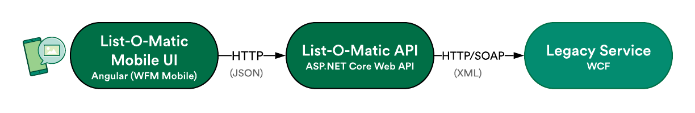

List-O-Matic Mobile Backend
====================

This repository hosts the ASP.NET Core Web API consumed by the WFM Mobile hosted List-O-Matic application. 

Introduction
------------
This API does not directly interact with the List-O-Matic database, and instead serves only as a proxy to existing List-O-Matic WCF services.

The SCMPA/SCMSE team has no intention to take ownership of the legacy List-O-Matic WCF service. This is owned, managed and supported by the Global IT Business Intelligence team, lead by [Tania Lincoln](mailto:tania.lincoln@wholefoods.com).

This solution was architected in this way for several reasons:
- **Increased control via abstraction**
  - By abstracting away from the existing legacy WCF service, we have the control to define and potentially later alter the service contract between the new List-O-Matic Mobile UI and this API.
  - For instance, the existing legacy service does not implement any authentication mechanism, which is a notable security risk. Abstraction allows this API to align with organizational AuthN and AuthZ practices without requiring changes to  legacy services.
  - Additionally, we gain the ability to optimize API calls to match non-functional requirements.
- **Speed to market**
  - This light-touch approach allows us to deliver at an accelerated pace, matching that required by the WFM Mobile program.
- **Side-by-side support**
  - As this solution requires no changes to legacy services, the legacy List-O-Matic WinCE mobile app remains functional and can be used side-by-side with the new Honeywell Android app.
- **No appetite for feature development**
  - The business has expressed that at present, there is no appetite to increase the featureset of List-O-Matic. This is due to a heavy reliance/integration with SMORe, a reporting solution slated for decommissioning in FY20/21.
- **Business logic parity**
  - By utilizing existing legacy services, we guarantee parity in the core business logic being invoked. 

---------------

Development
-----------

### Requirements
- VS2019
- WFM Internal network access (VPN included)
- Docker *(Optional)*

### Build & Debug
1. Open the solution in Visual Studio
2. Select either "Docker" or "WFM.Listomatic.API" from the profiles dropdown
3. Hit start.
4. Make sure you accept and confirm any certificate installation prompts you receive. 

### Accessing the API
If you selected Docker as the debug profile, you will be able to access the application with the following URLs:
- HTTP: `http://localhost:50692`
- HTTPS: `http://localhost:44349`

If you selected "WFM.Listomatic.API" as the debug profile, you should be able to access the application from the following URL:
- HTTP: `http://localhost:9191`

<!> NOTE: Due to some network quirks when testing with a device, the API can be set up to bind to `0.0.0.0`, making it accessible from outside the local machine, via your machine hostname, when running under the "WFM.Listomatic.API" profile. **To enable this, uncomment the commented line in Program.cs**.

This means that when running, the API is accessible over both of the following URLs:
- `http://{HOSTNAME}:9191/`

**<!> NOTE: This configuration will not work when running under the Docker profile.**

### Swagger UI
This project is Swagger UI enabled. The Swagger UI is accessible by appending `/swagger` to the end of one of the URLs provided above (e.g. `http://localhost:9191/swagger`).

---------------

Configuration
-------------

TBC.

---------------

Deployment
----------

This project is packaged as a Docker container and hosted as a service in a dedicated AWS Fargate cluster.

### Build the container:

`docker build -t wfmlistomaticapi:test -f "./src/WFM.Listomatic.API/Dockerfile" "./src"`

- *<!> This command assumes current path is repository root*
- *<!> Replace `{tag}` with your desired tag for the container image (e.g. `test`)*

### Run the container:

`docker run -d -p {desired_port}:80 --name {container_name} wfmlistomaticapi:{tag}`

- *<!> Replace `{desired_port}` with your desired port (e.g. `41235`)*
- *<!> Replace `{container_name}` with your desired container instance name (e.g. `lom-api-test`)*
- *<!> Replace `{tag}` with the tag you used in the build step (e.g. `test`)*

### Check the containers logs:

`docker logs --tail {container_id}`
- *<!> Replace {container_id} with the id that was output by docker from the previous run step*

### Check the API is up:

Browse to `http://localhost:{desired_port}/swagger`.
- *<!> Replace `{desired_port}` with the port you used in the earlier run step*

### Stop and remove the container instance:

`docker stop {container_id}; docker rm {container_id}`
- *<!> Replace {container_id} with the id that was output by docker from the previous run step*

---------------

Environments
------------

| Environment | Mobile UI URL | Mobile Backend URL | Legacy Web URL | Legacy Service URL |
| ----------- | ------------- | ------------------ | -------------- | ------------------ |
| DEV         | https://d2nmqgei6s5fdg.cloudfront.net/ | TBC | http://listomaticdev/listomatic/home.aspx | http://cewp5029.wfm.pvt/listomaticserviceDEV/Service.svc |
| TST         | TBC           | TBC                | http://listomatictst/listomatic/home.aspx| http://cewp5029.wfm.pvt/listomaticserviceTST/Service.svc |
| QA          | TBC           | TBC                | http://listomaticqa/listomatic/home.aspx| http://cewp5029.wfm.pvt/listomaticserviceQA/Service.svc |
| PRD         | TBC           | TBC                | http://listomatic/listomatic/home.aspx| http://cewp5029.wfm.pvt/listomaticservice/Service.svc |